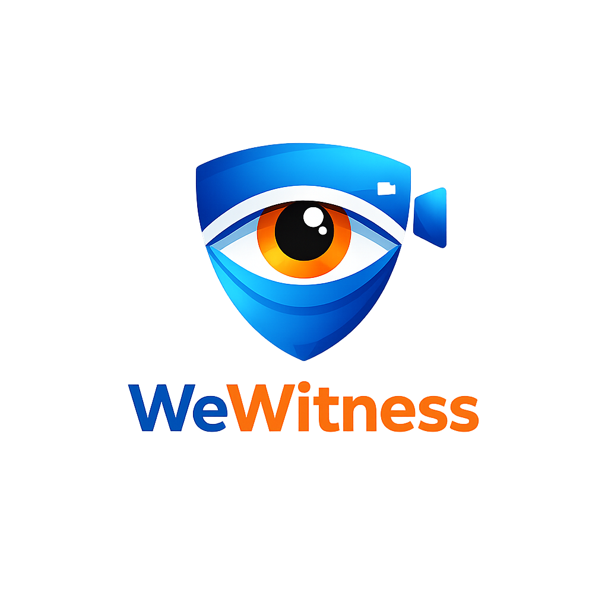

<div align="center">
  
  <h1>WeWitness</h1>
</div>

A people-first safety app that helps you **securely back up** important video evidence in real time—so footage remains available even if a phone is stolen, broken, or the recording is forcibly deleted.

> **Design principle:** Backup first. Sharing is always user-controlled. No public “nearby videos” feed.

---

## Why this exists

When something unsafe happens in public, the most important evidence is often recorded on a phone—then lost due to:
- theft or device damage,
- forced deletion / intimidation,
- app crashes or poor connectivity,
- accidental loss.

WeWitness focuses on **instant, encrypted backup** while recording, with optional **incident-based** community witness contributions—without enabling stalking, doxxing, or public surveillance.

---

## What it does

### 1) Personal Safety Vault (Default)
- Records video and **uploads encrypted chunks** continuously (e.g., every 1–3 seconds).
- Video can be recovered even if the phone is taken or destroyed.
- Only the recorder (and explicitly shared recipients) can view.

### 2) Incident Beacon (Opt-in, Event-Based)
- A user can start an **Incident Beacon** tied to a **time window + approximate area**.
- Nearby opted-in users can contribute footage **to that incident only** (not a public feed).
- Incident visibility is limited to:
  - incident creator,
  - contributors,
  - explicitly shared recipients (trusted contacts, attorney, investigator, etc.).

---

## Privacy & Safety (Non-Negotiables)

This project is explicitly designed to avoid becoming a surveillance or stalking tool:

- ✅ **No public discovery feed** of nearby videos
- ✅ **Opt-in only** community contributions
- ✅ **Coarse location only** (tile/geohash), never precise pins by default
- ✅ **Time-windowed incidents** (e.g., last 20–30 minutes)
- ✅ **User-controlled sharing** (default private vault)
- ✅ **Reporting + moderation** for any shared content
- ✅ **Rate limiting + abuse prevention**
- ✅ Optional **auto-blur** for faces/license plates on shared exports
- ✅ **Retention controls** (auto-delete unless preserved)

---

## How it works (High Level)

### On-device
- Video is recorded and split into **small chunks** (e.g., 1–3s).
- Each chunk is **encrypted locally** before upload.
- Upload is resumable and continues during connectivity changes.

### Server
- Stores only **encrypted blobs** + minimal metadata.
- Default posture is **zero-knowledge-ish**: server cannot view content without a user-provided key.

### Sharing
- Sharing is key-based:
  - the video encryption key is shared (securely) with approved recipients,
  - recipients can decrypt and view.

### Evidence Integrity (Optional)
- Each chunk is hashed and a signed receipt can be issued for tamper-evidence / chain-of-custody support.

---

## MVP Scope (Phase 1)

**Goal:** Prove “record → encrypt → upload → recover” is reliable.

### Must-have
- Account + device verification
- Record video + continuous encrypted backup (chunked upload)
- Safety Vault gallery (private)
- Trusted Contacts (share specific videos)
- Emergency UX:
  - “Panic upload”
  - “Share last 2 minutes”
  - “One-tap share to Trusted Contact”
- Export video (decrypted locally for export)

### Nice-to-have
- Evidence receipts (hash log)
- Background upload improvements
- Low-bandwidth mode (reduced bitrate)

---

## Phase 2: Incident Beacon (Beta)

- Create incident beacon (time window + coarse location tile)
- Allow opt-in nearby contributors
- Incident owner can:
  - request specific time range,
  - export a compiled evidence package,
  - share access with selected recipients.

---

## Tech Stack (Suggested)

### Mobile
- **React Native** or **Flutter**
- Background upload support + local encryption

### Backend
- Node.js / Go
- PostgreSQL
- Redis (rate limiting, queues)

### Storage
- S3-compatible object storage
- Lifecycle rules for retention and auto-deletion

### Notifications
- APNs + FCM

### Crypto
- libsodium (preferred) or vetted platform crypto
- Envelope encryption for key sharing

---

## Repository Structure (Planned)

> This repo is intended to be a monorepo once code lands.

```
/
├─ apps/
│  └─ mobile/                 # React Native or Flutter app
├─ services/
│  ├─ api/                    # REST/GraphQL API
│  └─ worker/                 # Background jobs (exports, retention, receipts)
├─ infra/
│  └─ terraform/              # Infrastructure as code
├─ docs/
│  ├─ privacy.md
│  ├─ data_retention.md
│  ├─ threat_model.md
│  ├─ law_enforcement_requests.md
│  ├─ misuse_policy.md
│  └─ architecture.md
└─ README.md
```

---

## Getting Started (Dev)

> Coming soon — initial skeleton will include the mobile app + API + local dev setup.

Planned entry points:
- `apps/mobile/README.md` — mobile setup
- `services/api/README.md` — backend setup
- `docs/architecture.md` — encryption + upload flow

---

## Project Values

WeWitness exists to help ordinary people preserve their own recordings and stay safe.
It is not intended for harassment, doxxing, vigilantism, or creating public surveillance systems.

- **Privacy by default**
- **User-owned evidence**
- **Minimal data collection**
- **Safety over virality**
- **Transparency over secrecy**

---

## Contributing

Contributions are welcome, especially around:
- background recording/upload reliability,
- encryption/key-handling review,
- abuse prevention + privacy design,
- incident workflows and UX.

See `CONTRIBUTING.md` and `SECURITY.md`.

---

## Disclaimer

WeWitness is intended to improve personal and community safety and preserve user-owned evidence.

Recording laws (especially audio) vary by jurisdiction. Users are responsible for complying with local laws.

This project does not provide legal advice and cannot guarantee evidentiary admissibility.
Integrity features may help support authenticity and chain-of-custody workflows.

---

## License

TBD (MIT / Apache-2.0 recommended for open source, or proprietary if you plan to commercialize).

---
<p align="center">
  A project by <a href="https://github.com/jordanistan">jordanistan</a>.
</p>
